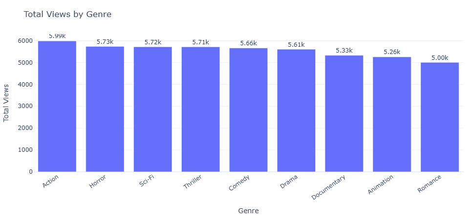
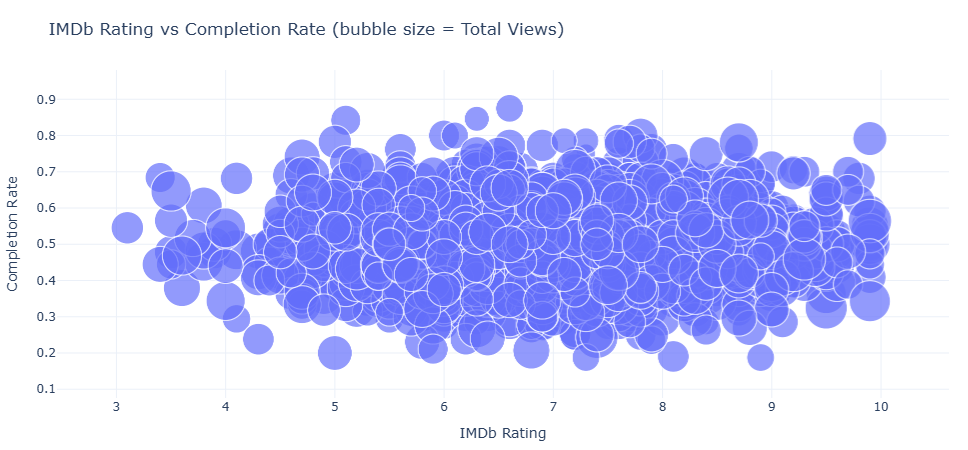
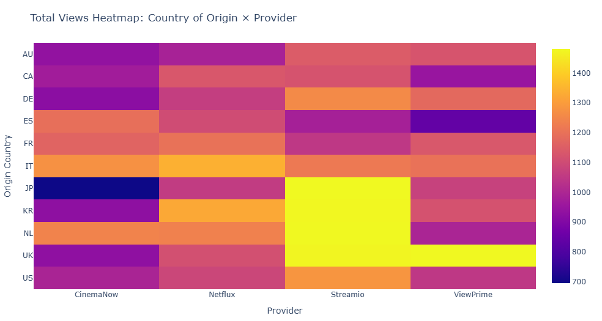

# Streaming Metadata Analytics Project (2025)

**End-to-end Data Analytics & BI case study focused on streaming content performance and engagement modeling**
*Python • Jupyter • Power BI • Excel*

🔗 [View Dashboard Documentation & Live Link](dashboard/README.md)

---

## Overview

This project simulates a real-world streaming service analytics pipeline, similar to those used by companies such as Netflix, Prime Video, or Gracenote (Nielsen) to analyze content performance and user engagement.

The goal is to demonstrate a complete data analytics workflow, from raw data ingestion to KPI engineering, advanced exploratory analysis, and business-facing dashboards.

This project is part of my Data Analyst portfolio, demonstrating technical depth, analytical rigor, and business-oriented decision framing.

## Objectives

- Build a realistic streaming analytics dataset
- Clean, merge, and enrich multiple data sources
- Engineer meaningful KPIs for content evaluation
- Perform exploratory and advanced data analysis
- Create interactive BI dashboards for stakeholders
- Communicate insights clearly through visualizations and documentation

## Key Insights

These insights are derived from exploratory analysis, KPI engineering,
and strategic segmentation across genre, provider, and engagement metrics.

- Sci-Fi drives the highest completion rate despite not leading in total views,
  suggesting engagement intensity is independent from volume
- Gini Index ≈ 0.06 indicates exceptionally balanced catalog consumption —
  no blockbuster dependency
- 26% of titles classified as Underperformers — direct candidates for
  catalog optimization
- Rewatch rate varies significantly by genre: Animation leads,
  Action underperforms relative to its view volume
- 91.3% Non-US content exposure reflects strong international diversification

---

## Selected Visuals

### Total Views by Genre


### IMDb Rating vs Completion Rate
Bubble size represents total views, highlighting the relationship between perceived quality,
viewer engagement, and overall reach.


### Total Views by Country of Origin and Provider


---

## Project Structure 

```text
streaming-metadata-analytics/
│
├── data/
│   ├── raw/                           # Original synthetic datasets
│   └── processed/                     # Enriched catalog dataset (feature-engineered)
│
├── notebooks/
│   ├── 01_exploration.ipynb           # Data cleaning, merging, KPI engineering
│   ├── 02_visualizations.ipynb        # Core exploratory visual analysis
│   └── 03_advanced_visualizations.ipynb
│                                       # Advanced visualizations & KPI summaries
│
├── dashboard/
│   ├── README.md                      # Interactive Power BI dashboard documentation
│   ├── Streaming_Dashboard.pdf        # Static export of the full dashboard
│   └── screenshots/                   # Dashboard screenshots
│       ├── overview.png
│       ├── provider.png
│       ├── genre.png
│       ├── catalog-health.png
│       ├── quality-vs-consumption.png
│       └── content-strategy.png
│
├── reports/
│   ├── Dataset_Dictionary.xlsx        # Dataset fields and metrics documentation
│   ├── Dashboard_Requirements.xlsx    # Business KPIs and dashboard requirements
│   ├── Project_Overview.xlsx          # Project scope and analytical goals
│   └── summary.md                     # Business insights & analytical conclusions
│
├── visuals/                           # Exported charts and notebook visuals
├── requirements.txt
└── README.md
```

---

## Datasets
All datasets are synthetic but designed to reflect realistic streaming platform behaviors and distributions.

1. Titles
- title_id
- title_name
- genre
- release_year
- origin_country
- original_language
- duration_min
- age_rating
- imdb_rating
- provider
- is_original
- date_added

2. Users
- user_id
- country
- signup_date
- plan_type
- primary_device
- age
- gender
- is_active

3. Viewing Sessions
- view_id
- user_id
- title_id
- start_time
- watch_duration_min
- completed
- rewatch_flag
- device
- country

---

## KPI Engineering

From the enriched streaming catalog, the following KPIs are computed:

**Popularity Score**

A weighted metric combining:
- Total views
- Unique viewers
- Completion rate
- IMDb rating
- Rewatch rate

**Engagement Score**

Based on:
- Average watch duration vs title duration
- Completion rate
- Rewatch rate

**Recency**

Calculated as: `2025 - release_year`

**Maturity**

Derived from content age rating

---

## Notebooks

`01_exploration.ipynb`
- Data cleaning and preprocessing
- Merging titles, users, and viewing sessions
- Feature engineering and KPI computation

`02_visualizations.ipynb`
- Exploratory analysis of content performance
- Genre, provider, and engagement comparisons
- Initial insights and distributions

`03_advanced_visualizations.ipynb`
- Correlation matrix of key KPIs
- Bubble charts (IMDb vs Completion)
- Boxplots and heatmaps
- High-level KPI summaries by genre, provider, and maturity rating

---

## Power BI Dashboard

The interactive Power BI dashboard extends the notebook analysis into a structured, business-facing decision-support framework.

**Live version and full documentation:**  
See [`dashboard/README.md`](dashboard/README.md)

Built on the enriched dataset:

`data/processed/streaming_catalog_enriched.csv`

The dashboard translates engineered KPIs into strategic insights across six structured sections:

- Executive Overview of catalog performance  
- Provider benchmarking with Completion Lift vs global average  
- Genre efficiency and engagement comparison  
- Catalog Health metrics (Gini Index, concentration, distribution analysis)  
- Quality vs Consumption behavioral analysis  
- Content Strategy Matrix (Blockbusters, Hidden Gems, Guilty Pleasures, Underperformers)

### Strategic Metrics Highlight

- **Gini Index ≈ 0.06** → highly balanced catalog consumption  
- **~26% Underperformers** → potential optimization candidates  
- **Rewatch Index = 1.00** → stable engagement repetition  
- **High Non-US exposure** → diversified international footprint  

Compared to the static notebook visuals, the dashboard introduces:

- Dynamic performance segmentation logic  
- Median-based quadrant modeling  
- Gini coefficient implemented in DAX  
- Controlled filter-context benchmarking  
- Fully interactive slicer architecture  

### Dashboard Preview


Additional screenshots and a static export are available in:

`dashboard/README.md`  
`dashboard/Streaming_Dashboard.pdf`

---

## Documentation & Reports

The `reports/` folder includes business and technical documentation used to guide and summarize the analysis:
- Dataset dictionary describing all fields and metrics
- Dashboard requirements outlining KPIs and business goals
- Project overview defining scope and analytical objectives
- Final analytical **summary** with business insights and conclusions (`summary.md`)

---

## Technologies Used

- Python (Pandas, NumPy, Matplotlib, Seaborn, Plotly)
- Jupyter Notebook
- Visual Studio Code
- Power BI
- Excel

---

## Author

**Matteo Cavo**
Data Analyst · Metadata & content expert
12+ years of international experience in content and metadata operations
(Nielsen / Gracenote, Netflix, Amazon, Disney+, RAI, SKY)
Focused on analytics, performance modeling, and metadata intelligence.
