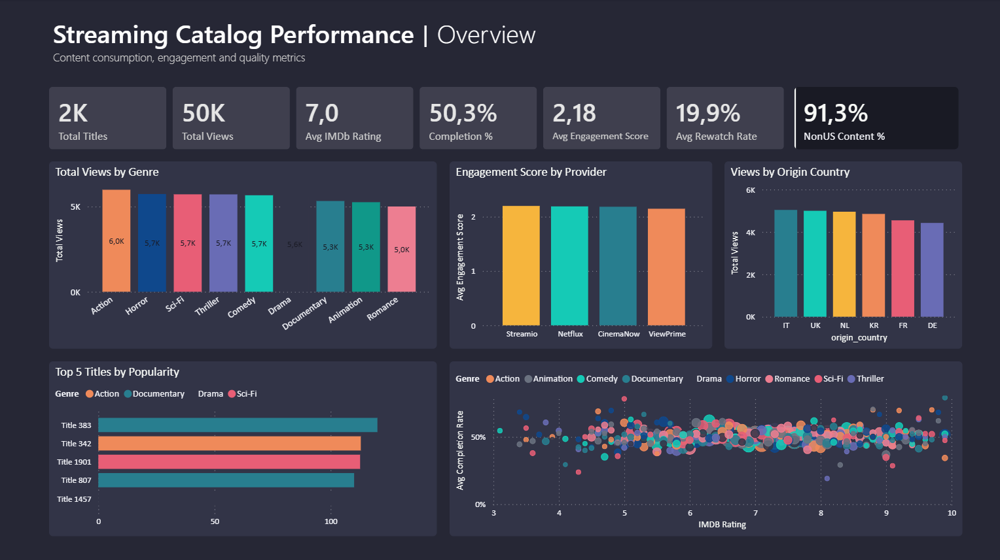
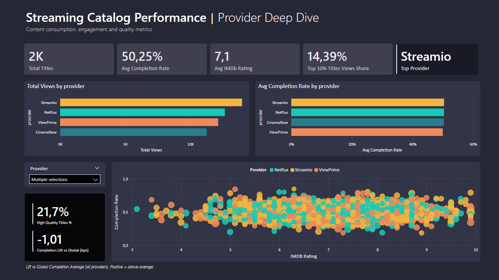
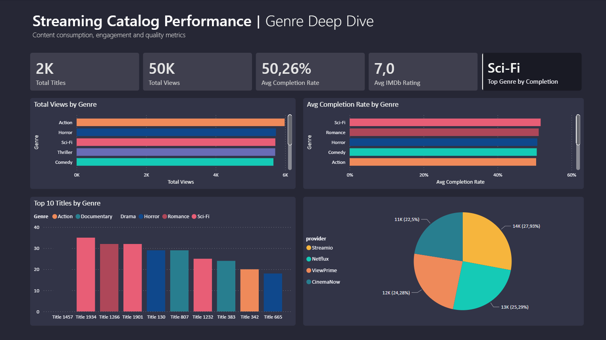
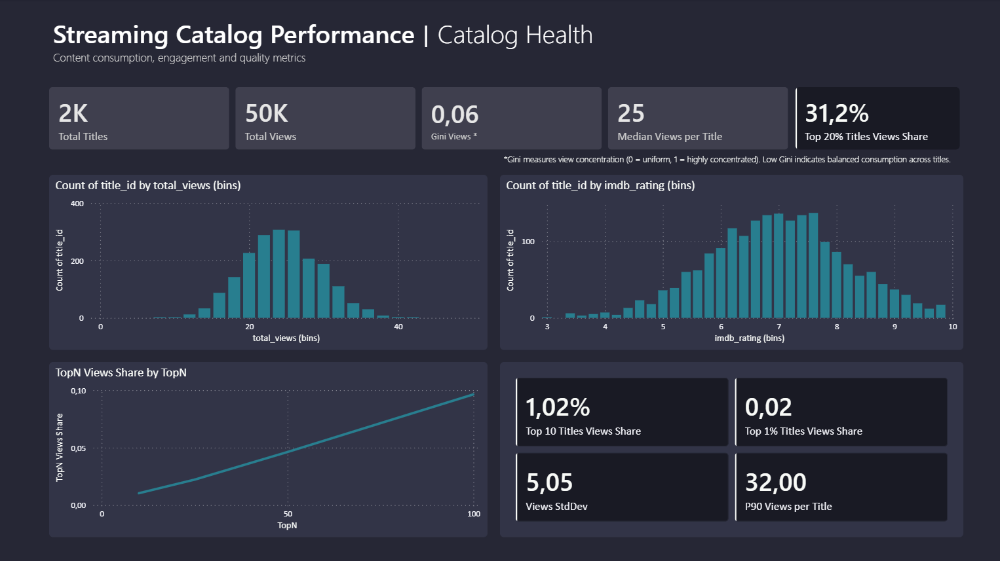
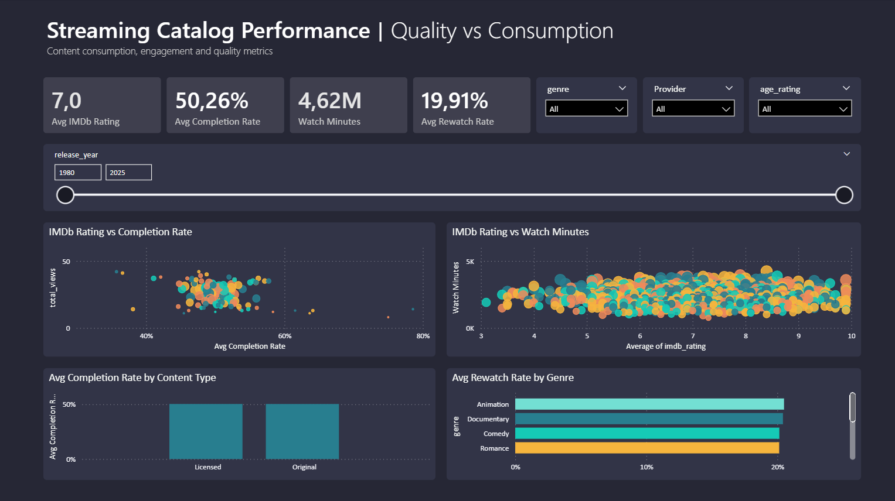
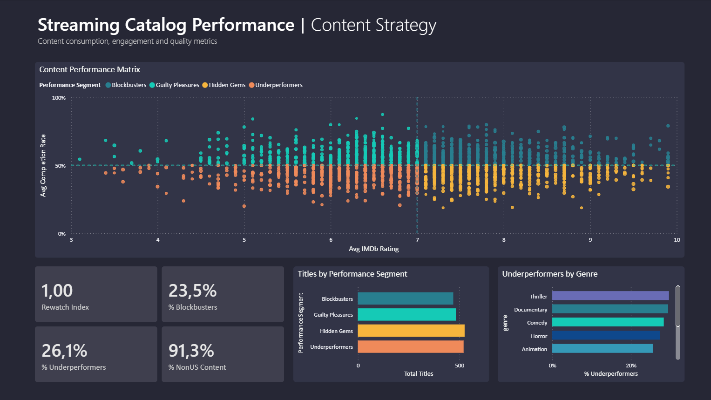

# Power BI Dashboard — Streaming Catalog Performance

This folder contains the interactive Power BI dashboard built as part of the **Streaming Metadata Analytics** project.

---

## Live Dashboard

[Interactive Dashboard](https://app.powerbi.com/view?r=eyJrIjoiOTQ1M2ExNmQtZWNjMi00YWQ5LWFjMDAtYzIxN2U2MDkxMTk3IiwidCI6IjgwNjZmMmRlLTgxZDctNGVjNC04Y2E5LTgzNzVjOTA4NjViNSJ9)

Best viewed on desktop for full interactivity.

---

## Project Context

This dashboard is part of the broader **Streaming Metadata Analytics** project.

The objective is to transform raw streaming metadata into a strategic decision-support system capable of answering:

- Is the catalog structurally healthy?
- What truly drives engagement?
- Where should a platform invest or divest?

The dashboard analyzes 2,000 titles across 21 engineered metadata attributes including:

- Genre  
- Provider  
- Origin Country  
- Original Language  
- Completion Rate  
- Rewatch Rate  
- Watch Duration  
- Popularity Score  
- Release Year  

The dashboard is built on the enriched dataset:

`data/processed/streaming_catalog_enriched.csv`

This file contains the fully processed and feature-engineered catalog used for analytical modeling and segmentation.

---

## Analytical Framework

Rather than focusing on descriptive reporting, the dashboard is structured around three business decisions.

### 1. Catalog Health & Risk Exposure

Key Metric:

- **Gini Index = 0.06**

Interpretation:

- Indicates extremely balanced consumption
- The platform is not dependent on a small number of blockbusters

Includes:

- View distribution histograms  
- TopN share analysis  
- Concentration metrics  

---

### 2. Engagement Drivers

Cross-analysis of:

- IMDb Rating  
- Completion Rate  
- Rewatch Rate  
- Watch Minutes  

Key Insight:

Engagement efficiency varies more by genre than by rating quality.

Sci-Fi shows the highest completion efficiency despite not leading in total views, suggesting that engagement intensity is not directly proportional to volume.

---

### 3. Content Strategy Matrix

The core strategic model segments titles into four quadrants:

| Segment            | Definition                              | Strategic Action              |
|--------------------|------------------------------------------|------------------------------|
| Blockbusters       | High Rating + High Completion            | Renew & promote              |
| Hidden Gems        | High Rating + Low Completion             | Improve discoverability      |
| Guilty Pleasures   | Low Rating + High Completion             | Retain for engagement        |
| Underperformers    | Low Rating + Low Completion              | Consider removal             |

Current distribution:

- 23.5% Blockbusters  
- 26.1% Underperformers  
- 91.3% Non-US content exposure  
- Rewatch Index = 1.00  

---

## Dashboard Structure

### Overview

High-level KPIs and global performance breakdown.

### Provider Deep Dive

Performance comparison and Completion Lift vs global benchmark.

### Genre Deep Dive

Completion efficiency and performance distribution by genre.

### Catalog Health

Consumption concentration and distribution analysis.

### Quality vs Consumption

Engagement behavior under interactive filters.

### Content Strategy

Performance segmentation matrix and strategic breakdown.

---

## Technical Implementation

The dashboard relies on advanced Power BI modeling techniques including:

- Advanced DAX measures with controlled filter context  
- Median-based segmentation logic  
- Completion Lift calculated against a dynamic global benchmark
- Gini coefficient implementation in DAX  
- Cross-filter stability handling  
- Interactive slicer architecture  
- Clean dark executive theme design  

---

## Dataset Design

The dataset is synthetically generated to simulate realistic streaming engagement patterns. 

This controlled design allows the modeling of behavioral dynamics (completion, rewatch, concentration) without noise from incomplete real-world data.

Attributes include:

- Genre  
- Provider  
- Origin Country  
- Original Language  
- Completion Rate  
- Rewatch Rate  
- Watch Duration  
- Popularity Score  
- Release Year  

Synthetic generation allowed controlled modeling of engagement dynamics and catalog distribution patterns.

---

## Key Takeaways

- The catalog shows low concentration risk (Gini ≈ 0.06), indicating structural resilience.
- Engagement efficiency varies more by genre than by perceived quality.
- Approximately 26% of titles fall into the Underperformers segment, representing optimization opportunities.
- Strong international exposure highlights diversified geographic demand.
---

## Project Scope

This dashboard demonstrates:

- Business-oriented analytical thinking  
- Advanced Power BI modeling  
- Strategic segmentation logic  
- Data storytelling for decision-making  
